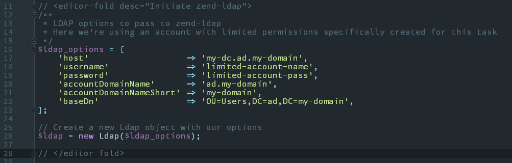
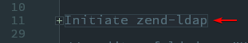

Example SignUp App  
-  
  
#### `SignUpApp/CommandInjection/adduser.ps1`  
This is a dummy script as I don't have access to the original.  

#### `SignUpApp/CommandInjection/injection_example.php`  
This is an example of how the injection vulnerability exploit works. While this performs a fairly benign task(writing text to a new file) you can use your imagination of what is possible.  

#### `SignUpApp/CommandInjection/team1_prevention_steps.php`  
This is a copy of `SignUpApp/CommandInjection/injection_example.php` but with Team 1's attempts at preventing injection.  
  
*Note: Since I don't have access to the original app I'm **assuming** that these are Team 1's modifications and not the original code.*  

  
As you can see their steps did nothing to prevent the injection. This is an example of why understanding what a function is actually doing is important.  
  
They attempted to use `stripslashes()` and `strip_tags()` to sanitize user input before passing it to `exec()`  
  
Why didn't this work? Because neither of the functions they used are intended to sanitize user input. PHP's documentation makes this aparent, and a simple test would have proven it.  
  
[stripslashes()](http://php.net/manual/en/function.stripslashes.php)  
> Returns a string with backslashes stripped off. (\\' becomes ' and so on.) **Double backslashes (\\\\) are made into a single backslash (\\)**.  
  
This function is ONLY meant to remove slashes when they are used to escape a character. It does not remove slashes entirely.  

[strip_tags()](http://php.net/manual/en/function.strip-tags.php)  
> This function tries to return a string with all NULL bytes, HTML and PHP tags stripped from a given str.  
  
This function makes no attempt to sanitize user input intended for use in a shell command. This function would be used when accepting user input that would eventually be displayed in a web page.     
  

#### `SignUpApp/CommandInjection/proper_solution.php`  
This is an example of how I might implement user creation through LDAP. This file is heavily commented so I won't explain it here.  
  
Note: The lines containing `<editor-fold desc="">` and `</editor-fold>` are for presentation purposes. They tell my IDE(PHPStorm) to create a 'fold'.  
  
Folds let you collapse sections of code. Turning  
  
  
  
Into  
  
